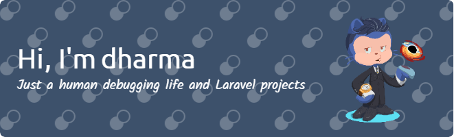

  

  <!--  -->   
  
  
  

<h1 align="center">Hi 👋, I'm dharma situmorang</h1>
<h3 align="center">A curious learner always seeking to improve and expand my skillset in the tech world.</h3>

- 🌱 I’m currently learning **Laravel, VueJS, and TailwindCSS**

- 📫 How to reach me **dharmasitumorang5146@gmail.com**

- ⚡ Fun fact **I think i am funny**  

- 🚀 My hope is to become a fullstack web developer.  

- 💬 I started learning coding since graduating from middle school. Until now i'm still learning 🙈.  

  
<h2 align="center">Languages and Tools</h2>
 

               

  

    
  

  

  

